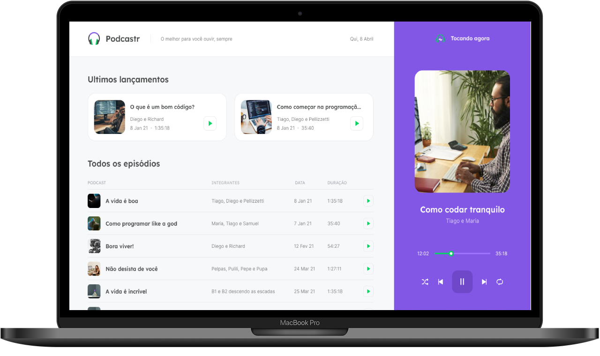

  

 
  

  This project was developed with the purpose of play episodes of audio podcasts easily and quickly.

  You can view all podcasts in home page and play it, in player you have functionalities to <strong>play the current podcast again (loop)</strong>, <strong>play a random podcast in queue (shuffle)</strong> and <strong>play next and previous podcast</strong>.

 

  This project was development with <code>Typescript</code>, <code>Next.js</code>, <code>SASS</code> and others technologies.

 

  

